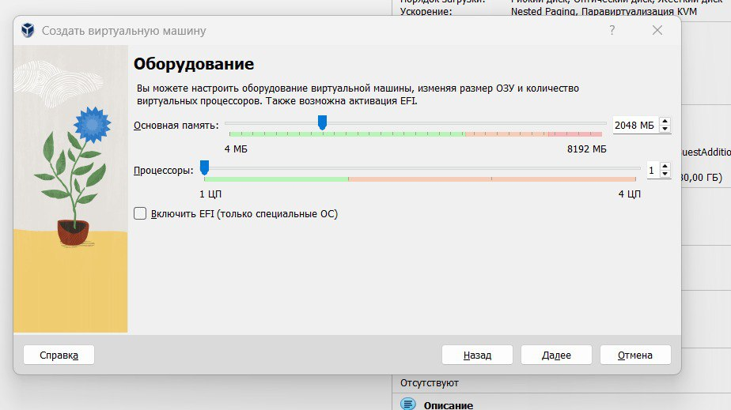
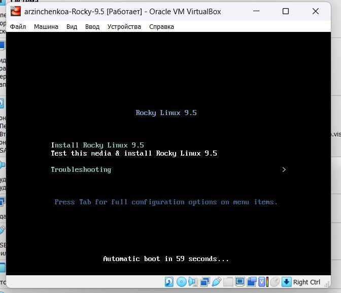
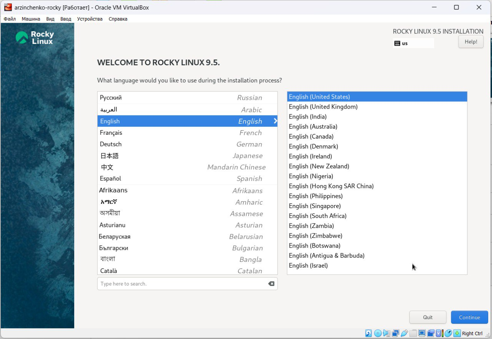
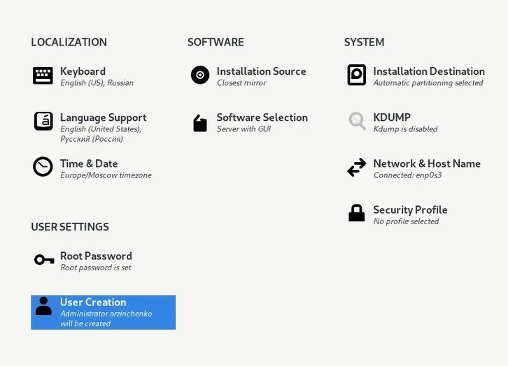
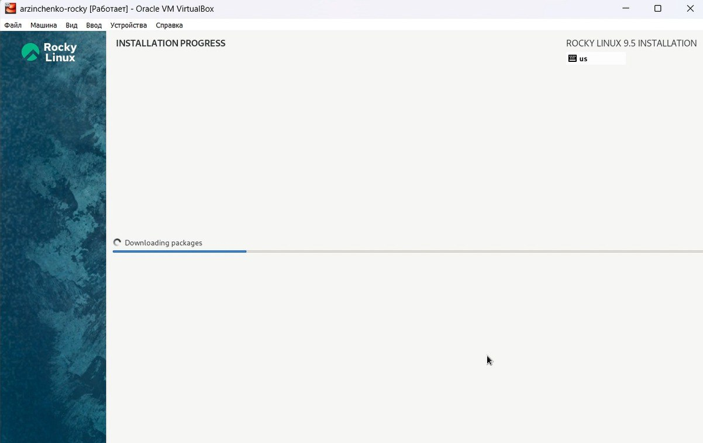
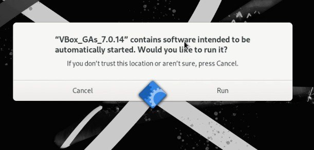
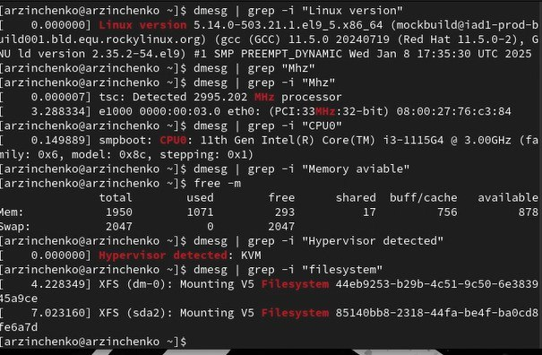

# Вводная часть

## Цель работы

Целью данной работы является приобретение практических навыков установки
операционной системы на виртуальную машину, настройки минимально
необходимых для дальнейшей работы сервисов.

# Выполнение лабораторной работы

Указала имя виртуальной машины, тип операционной системы --- Linux,
RedHat (64-bit) (рис. [-@fig:001]).

{#fig:001 width="70%"}

Указала размер основной памяти виртуальной машины (рис. [-@fig:002]).

{#fig:002
width="70%"}

Задала размер диска --- 40 ГБ (рис. [-@fig:003]).

{#fig:003 width="70%"}

Добавила новый привод оптических дисков и выбрала образ операционной
системы (рис. [-@fig:004]).

{#fig:004 width="70%"}

Запустила виртуальную машину (рис. [-@fig:005]).

{#fig:005 width="70%"}

Выберала English в качестве языка интерфейса (рис. [-@fig:006]).

{#fig:006 width="70%"}

Перешла к настройкам установки операционной системы (рис. [-@fig:007]).

{#fig:007 width="70%"}

После завершения установки операционной системы корректно перезапустила
виртуальную машину (рис. [-@fig:008]).

{#fig:008 width="70%"}

Вошла в ОС под заданной при установке учётной записью. В меню
"Устройства" виртуальной машины подключила образ диска дополнений
гостевой ОС (рис. [-@fig:009]).

{#fig:009 width="70%"}

#Домашнее задание

Дождалась загрузки графического окружения и открыла терминал. В окне
терминала проанализировала последовательность загрузки системы, выполнив
команду dmesg. Использовала поиск с помощью grep: dmesg \| grep -i "то,
что ищем" И получила следующую информацию: 1. Версия ядра Linux (Linux
version). 2. Частота процессора (Detected Mhz processor). 3. Модель
процессора (CPU0). 4. Объем доступной оперативной памяти (Memory
available). 5. Тип обнаруженного гипервизора (Hypervisor detected). 6.
Тип файловой системы корневого раздела. (рис. [-@fig:010]).

{#fig:010 width="70%"}

# Контрольные вопросы + ответы

1.  Какую информацию содержит учётная запись пользователя?

Учётная запись, как правило, содержит сведения, необходимые для
опознания пользователя при подключении к системе, сведения для
авторизации и учёта. Это идентификатор пользователя (login) и его
пароль.

2.  Укажите команды терминала и приведите примеры:

-   для получения справки по команде используют *help*

-   для перемещения по файловой системе используют *cd*

-   для просмотра содержимого каталога используют *ls*

-   для определения объёма каталога используют *du*

-   для создания/удаления каталогов используют *mkdir/rmdir*, а для
    файлов *touch/rm*

-   для задания определённых прав на файл/каталог используют *chmod*

-   для просмотра истории команд используют *history*

3.  Что такое файловая система? Приведите примеры с краткой
    характеристикой.

Файловая система (англ. file system) --- порядок, определяющий способ
организации, хранения и именования данных во внешней памяти, и
обеспечивающий пользователю удобный интерфейс при работе с такими
данными. Простыми словами файловая система - это система хранения файлов
и организации каталогов. От файловой системы зависит, как файлы будут
кодироваться, храниться на диске и читаться компьютером.

Примеры:

-   FAT (англ. File Allocation Table «таблица размещения файлов») ---
    классическая архитектура файловой системы, которая из-за своей
    простоты всё ещё широко применяется для флеш-накопителей.
    Используется в дискетах, картах памяти и некоторых других носителях
    информации. Ранее находила применение и на жёстких дисках.

-   NTFS (англ. new technology file system --- «файловая система новой
    технологии») --- стандартная файловая система для семейства
    операционных систем Windows NT фирмы Microsoft.

-   Ext4 (англ. fourth extended file system, ext4fs) --- журналируемая
    файловая система, используемая преимущественно в операционных
    системах с ядром Linux, созданная на базе ext3 в 2006 году.

4.  Как посмотреть, какие файловые системы подмонтированы в ОС?

Следует ввести команду df.

5.  Как удалить зависший процесс?

Чтобы удалить зависшй процесс, надо сначала узнать его PID с помощью
команды *ps*. А после этого ввести *kill `<PID процесса>`{=html}*. И всё
готово!

# Выводы

В ходе выполнения лабораторной работы мы приобрели практические навыки
установки операционной системы на виртуальную машину, настройки
минимально необходимых для дальнейшей работы сервисов.

# Список литературы

1.  Лаборатораня работа №1 \[Электронный ресурс\] URL:
    https://esystem.rudn.ru/pluginfile.php/2580975/mod_folder/content/0/001-lab_virtualbox.pdf
2.  VirtualBox \[Электронный ресурс\] URL:
    https://www.virtualbox.org/wiki/Linux_Downloads
3.  Rocky Linux \[Электронный ресурс\] URL:
    https://rockylinux.org/ru-RU/download
