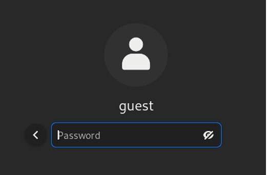
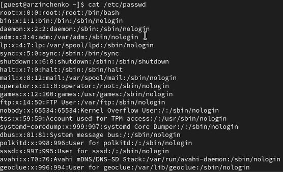

---
## Front matter
title: "Отчёт по лабораторной работе №2"
subtitle: "Дисциплина: Основы информационной безопасности"
author: "Зинченко Анастасия Романовна"

## Generic otions
lang: ru-RU
toc-title: "Содержание"

## Bibliography
bibliography: bib/cite.bib
csl: pandoc/csl/gost-r-7-0-5-2008-numeric.csl

## Pdf output format
toc: true # Table of contents
toc-depth: 2
lof: true # List of figures
lot: true # List of tables
fontsize: 12pt
linestretch: 1.5
papersize: a4
documentclass: scrreprt
## I18n polyglossia
polyglossia-lang:
  name: russian
  options:
	- spelling=modern
	- babelshorthands=true
polyglossia-otherlangs:
  name: english
## I18n babel
babel-lang: russian
babel-otherlangs: english
## Fonts
mainfont: PT Serif
romanfont: PT Serif
sansfont: PT Sans
monofont: PT Mono
mainfontoptions: Ligatures=TeX
romanfontoptions: Ligatures=TeX
sansfontoptions: Ligatures=TeX,Scale=MatchLowercase
monofontoptions: Scale=MatchLowercase,Scale=0.9
## Biblatex
biblatex: true
biblio-style: "gost-numeric"
biblatexoptions:
  - parentracker=true
  - backend=biber
  - hyperref=auto
  - language=auto
  - autolang=other*
  - citestyle=gost-numeric
## Pandoc-crossref LaTeX customization
figureTitle: "Рис."
tableTitle: "Таблица"
listingTitle: "Листинг"
lofTitle: "Список иллюстраций"
lotTitle: "Список таблиц"
lolTitle: "Листинги"
## Misc options
indent: true
header-includes:
  - \usepackage{indentfirst}
  - \usepackage{float} # keep figures where there are in the text
  - \floatplacement{figure}{H} # keep figures where there are in the text
---

# Цель работы

Целью данной работы является получение практических навыков работы в консоли с атрибутами файлов, закрепление теоретических основ дискреционного разграничения доступа в современных системах с открытым кодом на базе ОС Linux.

# Выполнение лабораторной работы

## Создание учётной записи пользовтеля guest

В установленной при выполнении предыдущей лабораторной работы операционной системе создаём учётную запись пользователя guest (используя учётную запись администратора): *useradd guest* (рис. [-@fig:001])

{#fig:001 width=70%}

Зададим пароль для пользователя guest: *passwd guest* (рис. [-@fig:002])

{#fig:002 width=70%}

Далее зайдём в систему от имени пользователя guest (рис. [-@fig:003])

{#fig:003 width=70%}

## После входа в систему от имени пользователя guest

Определим директорию, в которой мы находимся, командой *pwd*. (рис. [-@fig:004])

{#fig:004 width=70%}

Уточним имя нашего пользователя командой *whoami* (рис. [-@fig:005])

{#fig:005 width=70%}

Далее уточним имя нашего пользователя, его группу, а также группы, куда входит пользователь, командой *id* (рис. [-@fig:006])

{#fig:006 width=70%}  

Далее сравним вывод команды *id* с выводом команды *groups*. В выводе команды *groups* информация только о названии группы, к которой относится пользователь. В выводе команды *id* больше
информации: имя пользователя и имя группы, также коды имени пользователя и группы (рис. [-@fig:007])

{#fig:007 width=70%} 

Посмотрим файл /etc/passwd командой *cat /etc/passwd & grep guest*, чтобы найти в нём информацию об учётной записи пользователя guest, определить его uid и gid. Найденные значение совпадают с полученными в предыдущих выводах (рис. [-@fig:008])

{#fig:008 width=70%} 

Определим существующие в системе директории командой *ls -l /home/*. Нам удалось получить список поддиректорий директории /home. Права у директорий и guest: *drwx------* (рис. [-@fig:009])

{#fig:009 width=70%} 

Далее проверим какие расширенные атрибуты установлены на поддиректориях, находящихся в директории /home, командой: *lsattr /home*. Этого увидеть не удалось (рис. [-@fig:010])

{#fig:010 width=70%}  

Далее создадим в домашней директории поддиректорию dir1 командой *mkdir dir1* (рис. [-@fig:012])

{#fig:012 width=70%}  

Снимем с директории dir1 все атрибуты командой *chmod 000 dir1* (рис. [-@fig:012])

: Установленные права и разрешённые действия

| | | | | | | | | | |
|-|-|-|-|-|-|-|-|-|-|
|Права директории |Права файла|Создание файла|Удаление файла|Запись в файл|Чтение файла|Смена директории|Просмотр файлов в директории|Переименование файла|Смена атрибутов файла|
|d(000)|(000)|-|-|-|-|-|-|-|-|
|d(000)|(100)|-|-|-|-|-|-|-|-|
|d(000)|(200)|-|-|-|-|-|-|-|-|
|d(000)|(300)|-|-|-|-|-|-|-|-|
|d(000)|(400)|-|-|-|-|-|-|-|-|
|d(000)|(500)|-|-|-|-|-|-|-|-|
|d(000)|(600)|-|-|-|-|-|-|-|-|
|d(000)|(700)|-|-|-|-|-|-|-|-|
|d(100)|(000)|-|-|-|-|-|-|-|+|
|d(100)|(100)|-|-|-|-|-|-|-|+|
|d(100)|(200)|-|-|+|-|-|-|-|+|
|d(100)|(300)|-|-|+|-|-|-|-|+|
|d(100)|(400)|-|-|-|+|-|-|-|+|
|d(100)|(500)|-|-|-|+|-|-|-|+|
|d(100)|(600)|-|-|+|+|-|-|-|+|
|d(100)|(700)|-|-|+|+|-|-|-|+|
|d(200)|(000)|-|-|-|-|-|-|-|-|
|d(200)|(100)|-|-|-|-|-|-|-|-|
|d(200)|(200)|-|-|-|-|-|-|-|-|
|d(200)|(300)|-|-|-|-|-|-|-|-|
|d(200)|(400)|-|-|-|-|-|-|-|-|
|d(200)|(500)|-|-|-|-|-|-|-|-|
|d(200)|(600)|-|-|-|-|-|-|-|-|
|d(200)|(700)|-|-|-|-|-|-|-|-|
|d(300)|(000)|+|+|-|-|+|-|+|+|
|d(300)|(100)|+|+|-|-|+|-|+|+|
|d(300)|(200)|+|+|+|-|+|-|+|+|
|d(300)|(300)|+|+|+|-|+|-|+|+|
|d(300)|(400)|+|+|-|+|+|-|+|+|
|d(300)|(500)|+|+|-|+|+|-|+|+|
|d(300)|(600)|+|+|+|+|+|-|+|+|
|d(300)|(700)|+|+|+|+|+|-|+|+|
|d(400)|(000)|-|-|-|-|-|+|-|-|
|d(400)|(100)|-|-|-|-|-|+|-|-|
|d(400)|(200)|-|-|-|-|-|+|-|-|
|d(400)|(300)|-|-|-|-|-|+|-|-|
|d(400)|(400)|-|-|-|-|-|+|-|-|
|d(400)|(500)|-|-|-|-|-|+|-|-|
|d(400)|(600)|-|-|-|-|-|+|-|-|
|d(400)|(700)|-|-|-|-|-|+|-|-|
|d(500)|(000)|-|-|-|-|-|+|-|+|
|d(500)|(100)|-|-|-|-|-|+|-|+|
|d(500)|(200)|-|-|+|-|-|+|-|+|
|d(500)|(300)|-|-|+|-|-|+|-|+|
|d(500)|(400)|-|-|-|+|-|+|-|+|
|d(500)|(500)|-|-|-|+|-|+|-|+|
|d(500)|(600)|-|-|+|+|-|+|-|+|
|d(500)|(700)|-|-|+|+|-|+|-|+|
|d(600)|(000)|-|-|-|-|-|+|-|-|
|d(600)|(100)|-|-|-|-|-|+|-|-|
|d(600)|(200)|-|-|-|-|-|+|-|-|
|d(600)|(300)|-|-|-|-|-|+|-|-|
|d(600)|(400)|-|-|-|-|-|+|-|-|
|d(600)|(500)|-|-|-|-|-|+|-|-|
|d(600)|(600)|-|-|-|-|-|+|-|-|
|d(600)|(700)|-|-|-|-|-|+|-|-|
|d(700)|(000)|+|+|-|-|+|+|+|+|
|d(700)|(100)|+|+|-|-|+|+|+|+|
|d(700)|(200)|+|+|+|-|+|+|+|+|
|d(700)|(300)|+|+|+|-|+|+|+|+|
|d(700)|(400)|+|+|-|+|+|+|+|+|
|d(700)|(500)|+|+|-|+|+|+|+|+|
|d(700)|(600)|+|+|+|+|+|+|+|+|
|d(700)|(700)|+|+|+|+|+|+|+|+|

: Минимальные права для совершения операций

| | | | | |
|-|-|-|-|-|
|Операция| |Минимальные  права на  директорию| |Минимальные  права на файл|
|Создание файла| |d(300)| |-|
|Удаление файла| |d(300)| |-|
|Чтение файла| |d(100)| |(400)|
|Запись в файл| |d(100)| |(200)|
|Переименование файла| |d(300)| |(000)|
|Создание поддиректории| |d(300)| |-|
|Удаление поддиректории| |d(300)| |-|

# Выводы

В ходе выполнения лабораторной работы мы получили практические навыки работы в консоли с атрибутами файлов, закрепили теоретические основы дискреционного разграничения доступа в современных системах с открытым кодом на базе ОС Linux.

# Список литературы

1. Лаборатораня работа №2 [Электронный ресурс] URL: https://esystem.rudn.ru/pluginfile.php/2580978/mod_resource/content/6/002-lab_discret_attr.pdf
