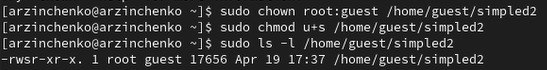
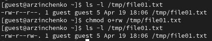
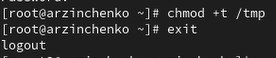

---
## Front matter
title: "Отчёт по лабораторной работе №5"
subtitle: "Дисциплина: Основы информационной безопасности"
author: "Зинченко Анастасия Романовна"

## Generic otions
lang: ru-RU
toc-title: "Содержание"

## Bibliography
bibliography: bib/cite.bib
csl: pandoc/csl/gost-r-7-0-5-2008-numeric.csl

## Pdf output format
toc: true # Table of contents
toc-depth: 2
lof: true # List of figures
lot: true # List of tables
fontsize: 12pt
linestretch: 1.5
papersize: a4
documentclass: scrreprt
## I18n polyglossia
polyglossia-lang:
  name: russian
  options:
	- spelling=modern
	- babelshorthands=true
polyglossia-otherlangs:
  name: english
## I18n babel
babel-lang: russian
babel-otherlangs: english
## Fonts
mainfont: PT Serif
romanfont: PT Serif
sansfont: PT Sans
monofont: PT Mono
mainfontoptions: Ligatures=TeX
romanfontoptions: Ligatures=TeX
sansfontoptions: Ligatures=TeX,Scale=MatchLowercase
monofontoptions: Scale=MatchLowercase,Scale=0.9
## Biblatex
biblatex: true
biblio-style: "gost-numeric"
biblatexoptions:
  - parentracker=true
  - backend=biber
  - hyperref=auto
  - language=auto
  - autolang=other*
  - citestyle=gost-numeric
## Pandoc-crossref LaTeX customization
figureTitle: "Рис."
tableTitle: "Таблица"
listingTitle: "Листинг"
lofTitle: "Список иллюстраций"
lotTitle: "Список таблиц"
lolTitle: "Листинги"
## Misc options
indent: true
header-includes:
  - \usepackage{indentfirst}
  - \usepackage{float} # keep figures where there are in the text
  - \floatplacement{figure}{H} # keep figures where there are in the text
---

# Цель работы

Целью данной работы является изучение механизмов изменения идентификаторов, применения SetUID- и Sticky-битов. Получение практических навыков работы в консоли с дополнительными атрибутами. Рассмотрение работы механизма смены идентификатора процессов пользователей, а также влияние бита
Sticky на запись и удаление файлов.

# Выполнение лабораторной работы

## Подготовка лабораторного стенда

Для лабораторной работы необходимо проверить, установлен ли компилятор gcc. Проверим это с помощью команды *gcc -v*. Также осуществим отключение системы запретов с помощью *sudo setenforce 0* и проверим командой *getenforce*, что выводится Permissive (рис. [-@fig:001])

{#fig:001 width=70%}

## Создание программы

Войдём в систему от имени пользователя guest. И создадим программу simpleid.c (рис. [-@fig:002]), (рис. [-@fig:003])

{#fig:002 width=70%}

Листинг программы simpleid.c:

```
#include <sys/types.h>
#include <unistd.h>
#include <stdio.h>
int
main ()
	{
		uid_t uid = geteuid ();
		gid_t gid = getegid ();
		printf ("uid=%d, gid=%d\n", uid, gid);
		return 0;
	}
```

{#fig:003 width=70%}


Скомплилируем программу и убедимся, что файл программы создан: *gcc simpleid.c -o simpleid* (рис. [-@fig:004])

{#fig:004 width=70%}

Выполним программу simpleid: *./simpleid*. В выводе файла выписыны номера пользоватея и групп, от вывода при вводе id, они отличаются только тем, что информации меньше (рис. [-@fig:005])

{#fig:005 width=70%}

Выполните системную программу id: *id* (рис. [-@fig:006])

{#fig:006 width=70%}

Далее усложним программу, добавив вывод действительных идентификаторов. Создадим программу под названием simpleid2.c (рис. [-@fig:007])

Листинг программы simpleid2.c:

```
#include <sys/types.h>
#include <unistd.h>
#include <stdio.h>
int
main ()
	{
		uid_t real_uid = getuid ();
		uid_t e_uid = geteuid ();
		gid_t real_gid = getgid ();
		gid_t e_gid = getegid () ;
		printf ("e_uid=%d, e_gid=%d\n", e_uid, e_gid);
		printf ("real_uid=%d, real_gid=%d\n", real_uid, real_gid);
		return 0;
	}
```

{#fig:007 width=70%}

Скомпилируем и запустим simpleid2.c: *gcc simpleid2.c -o simpleid2* и *./simpleid2* (рис. [-@fig:008]), (рис. [-@fig:009])

{#fig:008 width=70%}

{#fig:009 width=70%}

От имени суперпользователя выполним команды: *chown root:guest /home/guest/simpleid2* и *chmod u+s /home/guest/simpleid2*. Также выполним проверку правильности установки новых атрибутов и смены
владельца файла simpleid2: *ls -l simpleid2*. С помощью chown мы меняем владельца файла на суперпользователя, а с помощью chmod  меняем права доступа (рис. [-@fig:010])

{#fig:010 width=70%}

Запустим simpleid2 и id: *./simpleid2* и *id*. Наша команда снова вывела только ограниченное количество информации (рис. [-@fig:011])

{#fig:011 width=70%}

Создадим программу readfile.c (рис. [-@fig:012]), (рис. [-@fig:013])

{#fig:012 width=70%}

Листинг программы readfile.c:

```
#include <fcntl.h>
#include <stdio.h>
#include <sys/stat.h>
#include <sys/types.h>
#include <unistd.h>
int
main (int argc, char* argv[])
	{
		unsigned char buffer[16];
		size_t bytes_read;
		int i;
		int fd = open (argv[1], O_RDONLY);
		do
			{
				bytes_read = read (fd, buffer, sizeof (buffer));
				for (i =0; i < bytes_read; ++i) printf("%c", buffer[i]);
			}
		while (bytes_read == sizeof (buffer));
		close (fd);
		return 0;
	}
```

{#fig:013 width=70%}

Откомпилируем её: *gcc readfile.c -o readfile* (рис. [-@fig:014])

{#fig:014 width=70%}

Далее сменим владельца у файла readfile.c и изменим права так, чтобы только суперпользователь
(root) мог прочитать его, a guest не мог (рис. [-@fig:015])

{#fig:015 width=70%}

Проверим, может ли программа readfile прочитать файл readfile.c (рис. [-@fig:016])

{#fig:016 width=70%}

Теперь попробуем прочесть эти же файлы от имени суперпользователя (рис. [-@fig:018])

{#fig:018 width=70%}

## Исследование Sticky-бита

Выясним, установлен ли атрибут Sticky на директории /tmp, для чего выполним команду *ls -l / | grep tmp*. Так как ввыводе есть буква t, это значит что атрибут установлен (рис. [-@fig:019])

{#fig:019 width=70%}

От имени пользователя guest создадим файл file01.txt в директории /tmp со словом test: *echo "test" > /tmp/file01.txt* (рис. [-@fig:020])

{#fig:020 width=70%}

Просмотрим атрибуты у только что созданного файла *ls -l /tmp/file01.txt* и разрешим чтение и запись для категории пользователей «все остальные»: *chmod o+rw /tmp/file01.txt* (рис. [-@fig:021])

{#fig:021 width=70%}

От пользователя guest2 (не являющегося владельцем) попробуем прочитать файл /tmp/file01.txt: *cat /tmp/file01.txt* (рис. [-@fig:022])

{#fig:022 width=70%}

От пользователя guest2 попробуем дозаписать в файл /tmp/file01.txt слово test2 командой *echo "test2" > /tmp/file01.txt* (рис. [-@fig:023])

{#fig:023 width=70%}

От пользователя guest2 попробуем записать в файл /tmp/file01.txt слово test3, стерев при этом всю имеющуюся в файле информацию командой *echo "test3" > /tmp/file01.txt* (рис. [-@fig:024])

{#fig:024 width=70%}

От пользователя guest2 попробуем удалить файл /tmp/file01.txt командой *rm /tmp/file01.txt* (рис. [-@fig:025])

{#fig:025 width=70%}

Далее от имени суперпользователя снимем с директории tmp атрибут Sticky командой *chmod -t /tmp* (рис. [-@fig:026]), (рис. [-@fig:027])

{#fig:026 width=70%}

{#fig:027 width=70%}

# Выводы

В результате выполнения работы мы изучили механизмы изменения идентификаторов, применения SetUID- и Sticky-битов. Получили практические навыки работы в консоли с дополнительными атрибутами. Рассмотрели работы механизма смены идентификатора процессов пользователей, а также влияние бита
Sticky на запись и удаление файлов

# Список литературы

1. Лаборатораня работа №5 [Электронный ресурс] URL: https://esystem.rudn.ru/pluginfile.php/2580984/mod_resource/content/2/005-lab_discret_sticky.pdf

2. Инструментарий программиста в Linux: Компилятор GCC [Электронный ресурс] URL: http://parallel.imm.uran.ru/freesoft/make/instrum.html
