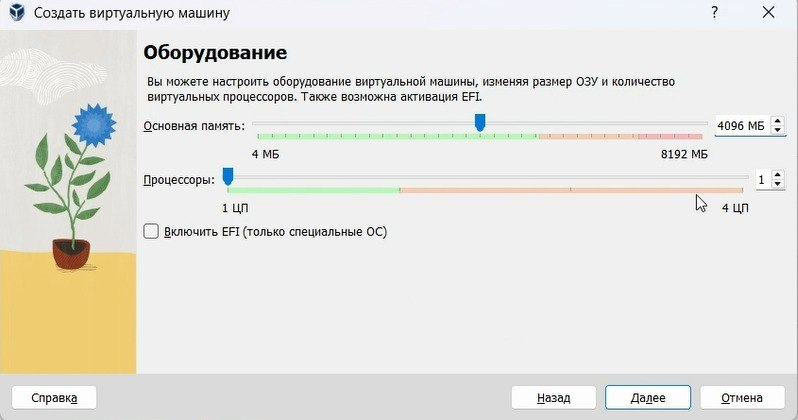
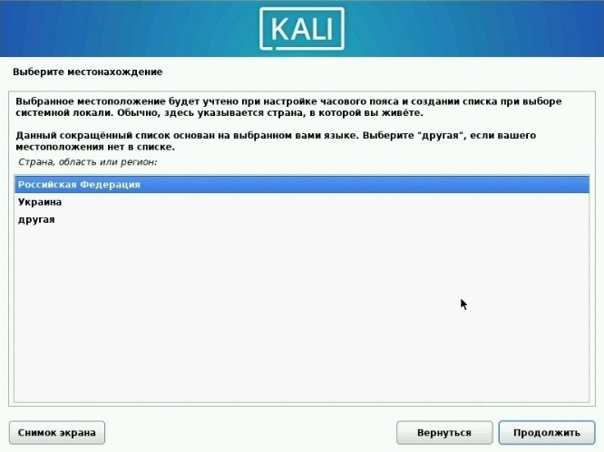
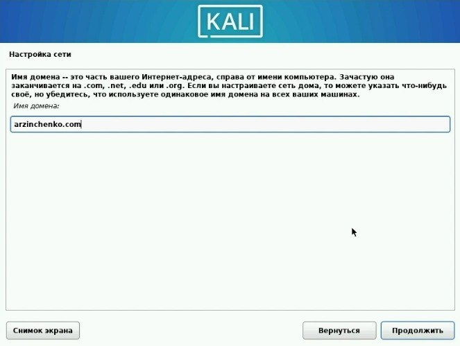
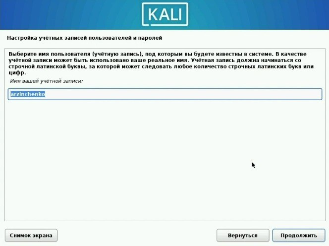
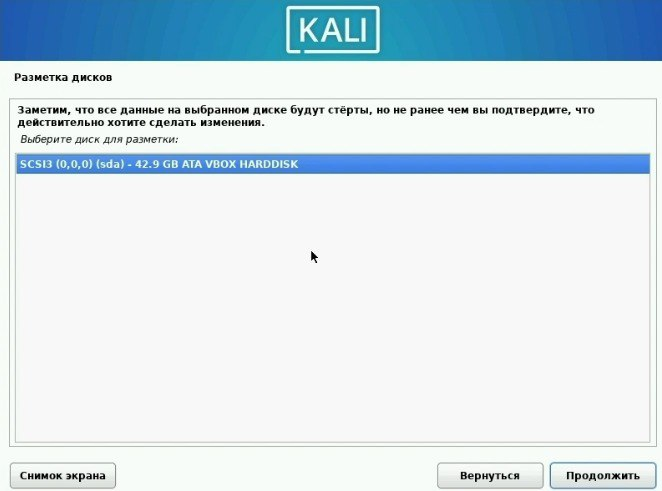
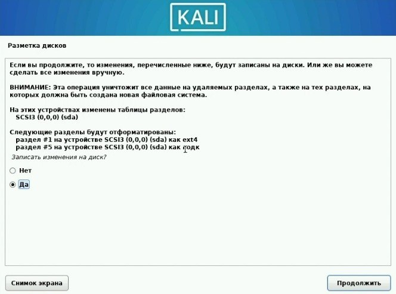
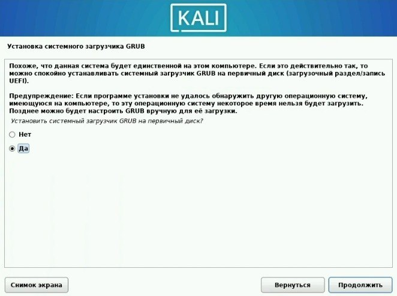
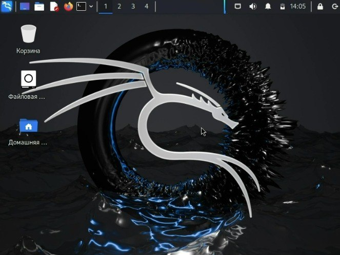

---
## Front matter
lang: ru-RU
title: Индивидуальный проект часть 1
subtitle: Основы информационной безопасности
author:
  - Зинченко А.Р., НБИбд-02-23
institute:
  - Российский университет дружбы народов, Москва, Россия
date: 22 февраля 2024

## i18n babel
babel-lang: russian
babel-otherlangs: english

## Formatting pdf
toc: false
toc-title: Содержание
slide_level: 2
aspectratio: 169
section-titles: true
theme: metropolis
header-includes:
 - \metroset{progressbar=frametitle,sectionpage=progressbar,numbering=fraction}
 - '\makeatletter'
 - '\beamer@ignorenonframefalse'
 - '\makeatother'
 
## Fonts
mainfont: PT Serif
romanfont: PT Serif
sansfont: PT Sans
monofont: PT Mono
mainfontoptions: Ligatures=TeX
romanfontoptions: Ligatures=TeX
sansfontoptions: Ligatures=TeX,Scale=MatchLowercase
monofontoptions: Scale=MatchLowercase,Scale=0.9
---

# Цель работы

Целью данной работы является установка Kali

# Выполнение лабораторной работы

Указала имя виртуальной машины, тип операционной системы — Linux, Debian (64-bit)  (рис. [-@fig:001]).

{#fig:001 width=70%}

Указала размер основной памяти виртуальной машины (рис. [-@fig:002]).

{#fig:002 width=70%}

Задала размер диска — 40 ГБ (рис. [-@fig:003]).

{#fig:003 width=70%}

Выбрала язык (рис. [-@fig:004]).

{#fig:004 width=70%}

Выбрала местонахождения (рис. [-@fig:005]).

{#fig:005 width=70%}

Настроила клавиатуру (рис. [-@fig:006]).

{#fig:006 width=70%}

Настроила клавиатуру (рис. [-@fig:007]).

{#fig:007 width=70%}

Ввела имя компьтера (рис. [-@fig:008]).

{#fig:008 width=70%}

Ввела имя домена (рис. [-@fig:009]).

{#fig:009 width=70%}

Создала учетную запись (рис. [-@fig:010]).

{#fig:010 width=70%}

Выбрала имя пользователя (рис. [-@fig:011]).

{#fig:011 width=70%}

Придумала пароль (рис. [-@fig:012]).

{#fig:012 width=70%}

Настроила время (рис. [-@fig:013]).

{#fig:013 width=70%}

Произвела разметку дисков (рис. [-@fig:014]).

{#fig:014 width=70%}

Произвела разметку дисков (рис. [-@fig:015]).

{#fig:015 width=70%}

Произвела разметку дисков (рис. [-@fig:016]).

{#fig:016 width=70%}

Произвела разметку дисков (рис. [-@fig:017]).

{#fig:017 width=70%}

Произвела разметку дисков (рис. [-@fig:018]).

{#fig:018 width=70%}

Установила GRUB (рис. [-@fig:019]).

{#fig:019 width=70%}

Установила GRUB (рис. [-@fig:020]).

{#fig:020 width=70%}

Запуск (рис. [-@fig:021]).

{#fig:021 width=70%}

# Выводы

В ходе выполнения лабораторной работы мы приобрели практические навыки установки Kali

# Список литературы{.unnumbered}

::: {#refs}
:::
