---
## Front matter
lang: ru-RU
title: Презентация по индивидуальному проекту. Этап № 2
subtitle: Основы информационной безопасности
author:
  - Зинченко А.Р
institute:
  - Российский университет дружбы народов, Москва, Россия
date: 22 марта 2025

## i18n babel
babel-lang: russian
babel-otherlangs: english

## Formatting pdf
toc: false
toc-title: Содержание
slide_level: 2
aspectratio: 169
section-titles: true
theme: metropolis
header-includes:
 - \metroset{progressbar=frametitle,sectionpage=progressbar,numbering=fraction}
---

# Информация

## Докладчик

  * Зинченко Анастасия Романовна
  * НБИбд-02-23
  * Российский университет дружбы народов

# Цель работы

Приобретение практических навыков по установке DVWA.

# Задание

1. Установить DVWA в гостевую систему Kali Linux.

# Выполнение 2-ого этапа индивидуального проекта

## Загрузка DVWA

DVWA (Damn Vulnerable Web Application) - это веб приложение на PHP/MySQL, которое "чертовски уязвимо". Его главное цель - помочь профессионалам или новечкам протестировать их навыки в сфере инормационной безопасности. На сайте https://nooblinux.com/how-to-install-dvwa/ очень хорошо и подробно описано как устанавливать и настраивать DVWA в гостевой системе Kali Linux. Поскольку мы будем настраивать DVWA на нашем локальном хосте, запустим терминал и перейдём в /var/www/html: *cd /var/www/html*. Это место, где хранятся файлы локального хоста (рис. [-@fig:001])

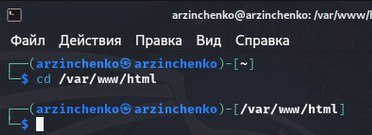{#fig:001 width=70%}

Далее склонируем репозиторий https://github.com/digininja/DVWA в каталог /html с помощью команды: *sudo git clone https://github.com/digininja/DVWA* (рис. [-@fig:002])

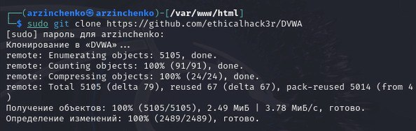{#fig:002 width=70%}

## Настройка DVWA

После успешного клонирования репозитория выполним команду *ls*, чтобы проверить успешное клонирование DVWA (рис. [-@fig:003])

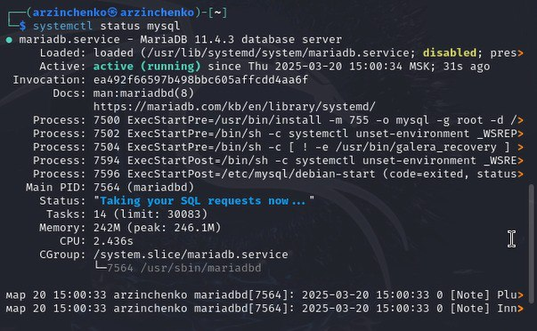{#fig:003 width=70%}

Теперь назначим разрешения Read, Write и Execute (777) для папки DVWA. Для этого выполним команду *sudo chmod -R 777 DWVA*(рис. [-@fig:004])

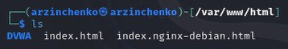{#fig:004 width=70%}

Для настройки и конфигурации DVWA перейдём в каталог DVWA/config: *cd  DVWA/config*. И посмотрим содержимое этого каталога (рис. [-@fig:005])

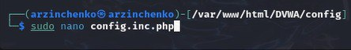{#fig:005 width=70%}

Мы видим файл с именем config.inc.php.dist. Этот файл содержит конфигурации DVWA по умолчанию. Не будем его трогать, и он будет нашей резервной копией, если дела пойдут не так. Вместо этого создадим копию этого файла с именем config.inc.php, которое будем использовать для настройки DVWA: *sudo cp config.inc.php.dist config.inc.php* (рис. [-@fig:006])

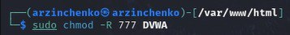{#fig:006 width=70%}

Теперь откроем config.inc.php файл в nano редакторе, чтобы выполнить необходимые настройки. Прокрутим вниз до точки, где мы увидим параметры, такие как db_database, db_user, db_password и т. д. Поменяем эти значения как нам удобно (рис. [-@fig:007]), (рис. [-@fig:008])

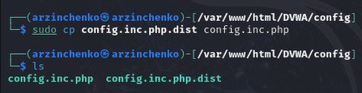{#fig:007 width=70%}

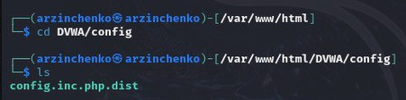{#fig:008 width=70%}

## Настройка базы данных

По умолчанию Kali Linux поставляется с установленной системой управления реляционной базой данных MariaDB . Поэтому нам не нужно устанавливать никаких пакетов. Сначала запустим службу mysql: *sudo systemctl start mysql* (рис. [-@fig:009])

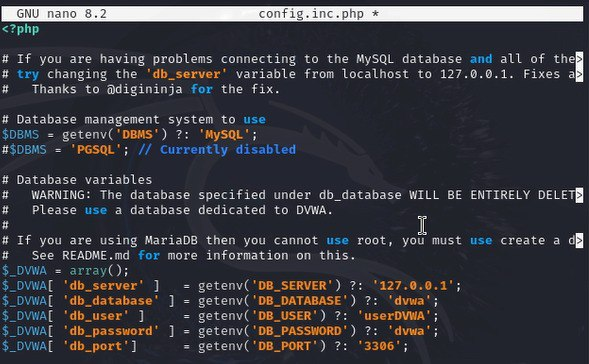{#fig:009 width=70%}

Проверим запущена ли служба: *systemctl status mysql* (рис. [-@fig:010])

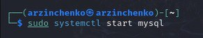{#fig:010 width=70%}

Для входа в базу данных используем команду *sudo mysql -u root -p*. В нашем случае мы используем root, так как это имя суперпользователя, установленное в нашей системе. Появляется командная строка с приглашением “MariaDB”, далее создадим в ней нового пользователя, используя учетные данные из файла config.inc.php с помощью команды *create user 'userDVWA'@'127.0.0.1' identified by "dvwa"* (рис. [-@fig:011])

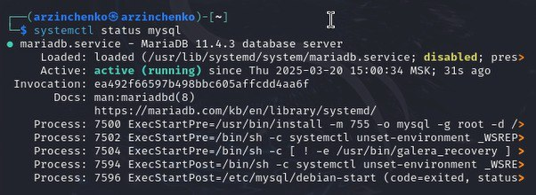{#fig:011 width=70%}

Теперь нам нужно предоставить этому пользователю полную привилегию над dvwaбазой данных. Выполним команду *grant all privileges on dvwa. to 'userDVWA'@'127.0.0.1' identified by "dvwa"* (рис. [-@fig:012])

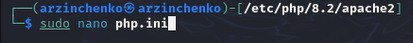{#fig:012 width=70%}

## Настройка сервера Apache

Веб-сервер Apache установлен по умолчанию в Kali Linux. Поэтому нам не нужно устанавливать никаких дополнительных пакетов. Чтобы приступить к настройке Apache2, запустиv nерминал и перейдём в /etc/php/8.2/apache2 (рис. [-@fig:013])

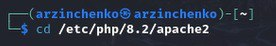{#fig:013 width=70%}

Далее откроем файл php.ini и найдём строки allow_url_fopen и allow_url_include. Они должны обе иметь значение On (рис. [-@fig:014]), (рис. [-@fig:015])

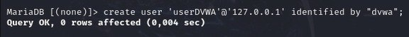{#fig:014 width=70%}

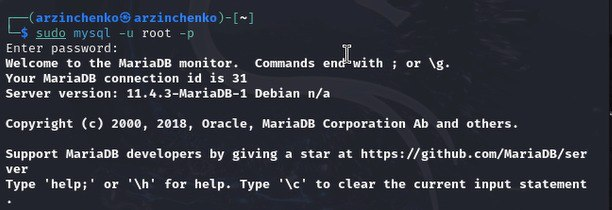{#fig:015 width=70%}

Далее запустим службу веб-сервера apache с помощью *sudo systemctl start apache2* (рис. [-@fig:016])

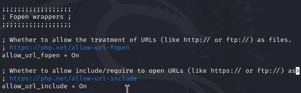{#fig:016 width=70%}

B проверим запущена ли служба: *systemctl status apache* (рис. [-@fig:017])

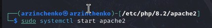{#fig:017 width=70%}

## Открытие DVWA в веб-браузере

К этому моменту мы настроили DVWA, базу данных и веб-сервер Apache. Теперь мы можем приступить к запуску приложения DVWA. Запустите веб-браузер и перейдём на страницу http://127.0.0.1/DVWA/setup.php (рис. [-@fig:018])

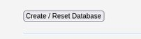{#fig:018 width=70%}

Прокрутив страницу вниз, нажмём кнопку «Создать/сбросить базу данных» в конце страницы (рис. [-@fig:019])

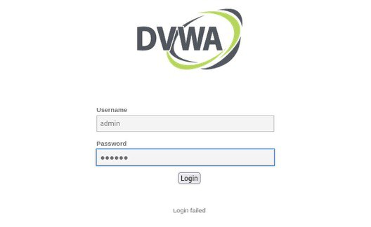{#fig:019 width=70%}

Это создаст и настроит базу данных DVWA. Через несколько секунд мы будем перенаправлены на страницу входа в DVWA. Для входа используем учетные данные по умолчанию: 

- Имя пользователя: admin
- Пароль: password

(рис. [-@fig:020])

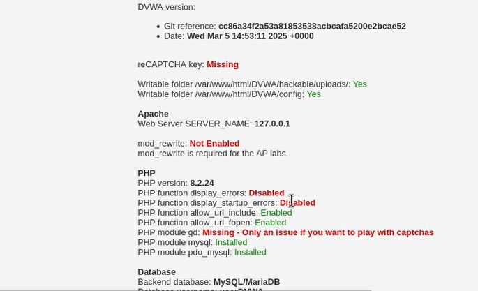{#fig:020 width=70%}

После успешного входа в систему мы окажемся на домашней странице DVWA (рис. [-@fig:021])

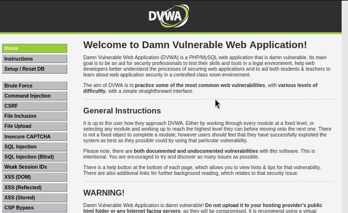{#fig:021 width=70%}

# Выводы
 
В ходе выполнения 2-ого этапа индивидуального проекта мы установили DVWA в гостевую систему Kali Linux

# Список литературы

1. Этапы реализации проекта [Электронный ресурс] URL: https://esystem.rudn.ru/mod/page/view.php?id=1220336
2. Репозиторий DVWA [Электронный ресурс] URL: https://github.com/digininja/DVWA
