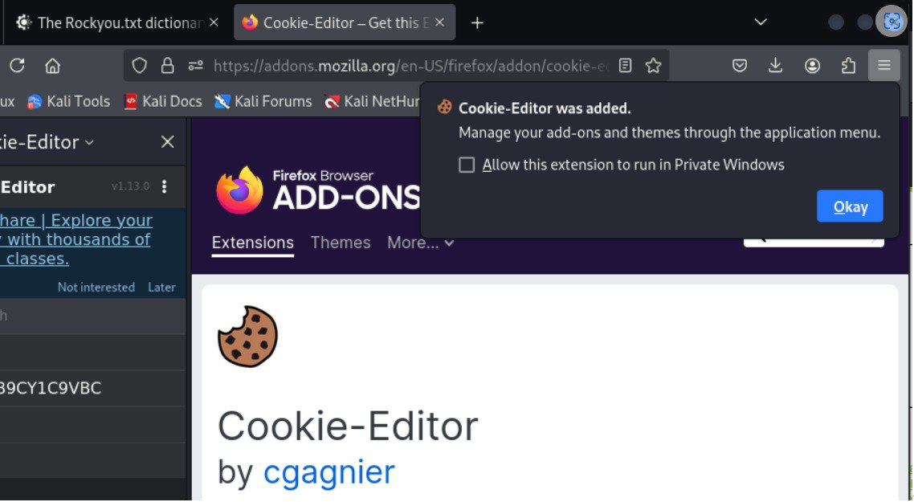
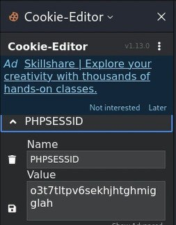
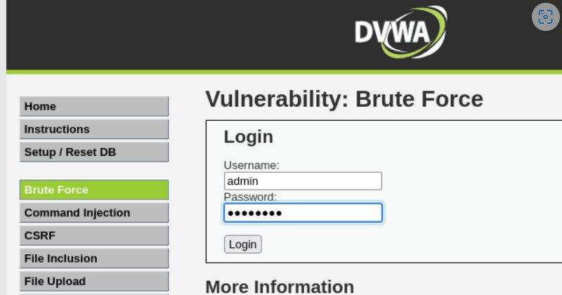

---
## Front matter
lang: ru-RU
title: 3-ый этап индивидуального проекта
subtitle: Основы информационной безопасности
author:
  - Зинченко А. Р., НБИбд-02-23
institute:
  - Российский университет дружбы народов, Москва, Россия
date: 12 апреля 2025

## i18n babel
babel-lang: russian
babel-otherlangs: english

## Formatting pdf
toc: false
toc-title: Содержание
slide_level: 2
aspectratio: 169
section-titles: true
theme: metropolis
header-includes:
 - \metroset{progressbar=frametitle,sectionpage=progressbar,numbering=fraction}
 - '\makeatletter'
 - '\beamer@ignorenonframefalse'
 - '\makeatother'
 
## Fonts
mainfont: PT Serif
romanfont: PT Serif
sansfont: PT Sans
monofont: PT Mono
mainfontoptions: Ligatures=TeX
romanfontoptions: Ligatures=TeX
sansfontoptions: Ligatures=TeX,Scale=MatchLowercase
monofontoptions: Scale=MatchLowercase,Scale=0.9
---

# Вводная часть

## Цель работы

Приобретение практических навыков по использованию инструмента Hydra для бутфорса паролей

## Задание

1. Реалзовать эксплуатацию уязвимости с помощью бутфорса паролей

# Выполнение 3-ого этапа индивидуального проекта

## Распаковка архива с паролями

Чтобы пробутфорсить пароль, нужно для начала найти большой список часто используемых паролей. Возьмём стандартный список паролей rockyou.txt для kali linux. Далее распакуем архив командой *sudo gzip -d*. Нужно сделать так, чтобы файл rockyou.txt находился в домашней директории (рис. 1)

{#fig:001 width=70%}

## Настройка cookie

Далее зайдём на сайт DVWA, который был получен в ходе предыдущего этапа индивидуального проекта. Для запроса hydra, который мы будем исползовать позже, нам понадобятся параметры cookie с этого сайта. Для того чтобы получить информацию о параметрах cookie надо установить расширение для браузера  (рис. 2)

{#fig:002 width=50%}

## Настройка cookie

Теперь мы можем увидеть параметры cookie, а также можем их скопировать (рис. 3)

{#fig:003 width=15%}

## Запрос к hydra

Теперь вводим в hydra запрос нужную информацию. Пароль будем подбирать для пользователя admin, используя get-запрос с двумя праметрами cookie (security и PHPSESSID). Для этого введём команду *hydra -l admin -P ~/rockyou.txt -s 80 localhost http-get-form "/DVWA/vulnerabilities/brute/:username=^USER^&password=^PASS^&Login=Login:H=Cookie:security=medium; PHPSESSID=mo5of0gko8op9bf62bhsbefkc1:F=Username and/or password incorrect."* (рис. 4)

{#fig:004 width=70%}

## Запрос к hydra

Спустя время появится результат с подходящим паролем. Введём полученные данные на сайт для проверки. После мы получим положительный результат проверки пароля. Всё правильно и всё хорошо!!! (рис. 5)

{#fig:005 width=60%}

## Запрос к hydra

{#fig:006 width=70%}

# Подведение итогов

## Выводы

В ходе выполнения 3-ого этапа индивидуального проекта мы приобрели практические навыки работы по использованию инструмента hydra для бутфорса паролей.

## Список литературы

1. Этапы реализации проекта [Электронный ресурс] URL: https://esystem.rudn.ru/mod/page/view.php?id=1220336
2. Словарь Rockyou.txt где находится в Kali Linux и как скачать [Электронный ресурс] URL: https://spy-soft.net/rockyou-txt/
3. How to Brute Force Attack on Web Forms? [Step-by-Step] [Электронный ресурс] URL: https://www.golinuxcloud.com/brute-force-attack-web-forms/
4. Расширение Cookie-Editor [Электронный ресурс] URL: https://addons.mozilla.org/en-US/firefox/addon/cookie-editor/?utm_campaign=external-cookie-editor.com
