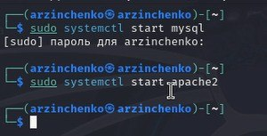
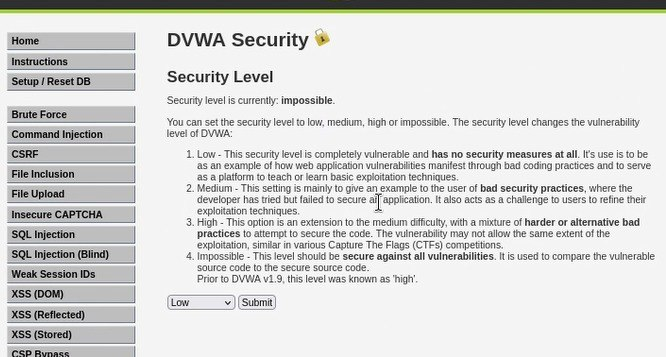
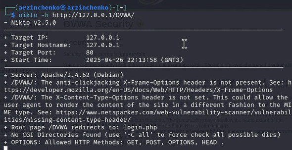
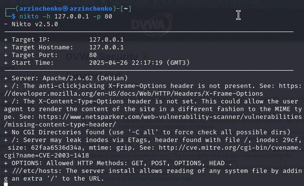

---
## Front matter
lang: ru-RU
title: 4-ый этап индивидуального проекта
subtitle: Основы информационной безопасности
author:
  - Зинченко А. Р., НБИбд-02-23
institute:
  - Российский университет дружбы народов, Москва, Россия
date: 12 апреля 2025

## i18n babel
babel-lang: russian
babel-otherlangs: english

## Formatting pdf
toc: false
toc-title: Содержание
slide_level: 2
aspectratio: 169
section-titles: true
theme: metropolis
header-includes:
 - \metroset{progressbar=frametitle,sectionpage=progressbar,numbering=fraction}
 - '\makeatletter'
 - '\beamer@ignorenonframefalse'
 - '\makeatother'
 
## Fonts
mainfont: PT Serif
romanfont: PT Serif
sansfont: PT Sans
monofont: PT Mono
mainfontoptions: Ligatures=TeX
romanfontoptions: Ligatures=TeX
sansfontoptions: Ligatures=TeX,Scale=MatchLowercase
monofontoptions: Scale=MatchLowercase,Scale=0.9
---

# Цель работы

Научиться тестировать приложения с помощью сканера nikto

# Задание

Ипспользование nikto

# Выполнение лабораторной работы

Чтобы работать с nikto, необходимо полготовить веб-приложение, которое будем сканировать запустила apache2 (рис. [-@fig:001]).

{#fig:001 width=70%}

Ввожу в адресной строке браузера адрес DVWA, перехожу в режим выбора уровня безопасности, ставлю минимальный (рис. [-@fig:002]).

{#fig:002 width=70%}

Запускаю nikto (рис. [-@fig:003]).

{#fig:003 width=70%}

Проверить веб-приложение можно, введя его полный URL и не вводя порт, попробовала просканировать так (рис. [-@fig:004]).

{#fig:004 width=70%}

Затем попробовала просканировать введя алрес хоста и адрес порта, результаты незначительно отличаются (рис. [-@fig:005]).

{#fig:005 width=70%}

# Выводы

Научилась тестировать приложения с помощью сканера nikto

# Список литературы{.unnumbered}

::: {#refs}
:::
