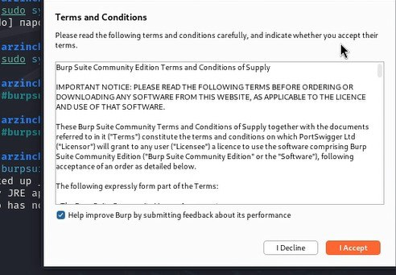

---
## Front matter
lang: ru-RU
title: 5-й этап индивидуального проекта
subtitle: Основы информационной безопасности
author:
  - Зинченко А.Р
institute:
  - Российский университет дружбы народов, Москва, Россия
date: 14 мая 2025

## i18n babel
babel-lang: russian
babel-otherlangs: english

## Formatting pdf
toc: false
toc-title: Содержание
slide_level: 2
aspectratio: 169
section-titles: true
theme: metropolis
header-includes:
 - \metroset{progressbar=frametitle,sectionpage=progressbar,numbering=fraction}
---

# Информация

## Докладчик

  * Зинченко Анастасия Романовна
  * НБИбд-02-23
  * Российский университет дружбы народов

# Цель работы

Научиться использовать Burp Suite

# Выполнение лабораторной работы

Запускаю локальный сервер, на котором открою веб-приложение DVWA для тестирования инструмента Burp Suite (рис. [-@fig:001]).

{#fig:001 width=70%}

Запускаю инструмент Burp Suite (рис. [-@fig:002]).

{#fig:002 width=70%}

Открываю сетевые настройки браузера, для подготовки к работе (рис. [-@fig:003]).

{#fig:003 width=70%}

Изменяю настройки Proxy инструмента Burp Suite для дальнейшей работы (рис. [-@fig:004]).

{#fig:004 width=70%}

Во вкладке Proxy устанавливаю "Intercept is on" (рис. [-@fig:005]).

{#fig:005 width=70%}

# Выводы

Научиkfcm использовать Burp Suite

# Список литературы{.unnumbered}

::: {#refs}
:::
